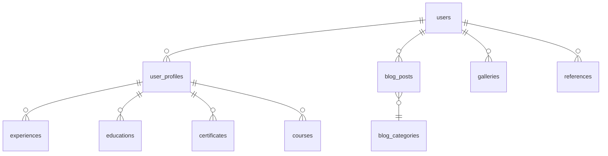

# Teknik Dokümantasyon

## 1. API Dokümantasyonu (OpenAPI/Swagger)

### Genel Bilgiler
- Tüm API uç noktaları HTTPS üzerinden çalışır.
- Kimlik doğrulama için Laravel Sanctum (Bearer Token) kullanılır.
- Yanıtlar JSON formatındadır.
- Hata yönetimi standart HTTP durum kodları ve JSON hata mesajları ile yapılır.

### Authentication (Kimlik Doğrulama)
- Giriş için `/api/v1/login` endpointi POST ile kullanılır.
- Başarılı girişte `access_token` döner, sonraki isteklerde `Authorization: Bearer {token}` header'ı zorunludur.

#### Örnek İstek
```http
POST /api/v1/login
Content-Type: application/json

{
  "email": "user@example.com",
  "password": "password"
}
```
#### Örnek Yanıt
```json
{
  "access_token": "eyJ0eXAiOiJKV1QiLCJhbGci...",
  "token_type": "Bearer"
}
```
// Türkçe: API'ye erişim için önce giriş yapılmalı ve token alınmalı.

### Hata Yönetimi
- Hatalı isteklerde aşağıdaki gibi standart bir JSON döner:
```json
{
  "success": false,
  "message": "Geçersiz kimlik bilgileri.",
  "errors": {
    "email": ["Bu alan gereklidir."]
  }
}
```
// Türkçe: Hatalar her zaman JSON formatında ve açıklayıcı mesajlarla döner.

### Pagination (Sayfalama)
- Liste endpointlerinde `?page=1&per_page=10` parametreleri desteklenir.
- Yanıtta meta alanı ile toplam, sayfa, vs. bilgileri döner.
```json
{
  "data": [ ... ],
  "meta": {
    "current_page": 1,
    "total": 50,
    "per_page": 10
  }
}
```
// Türkçe: Büyük veri setlerinde sayfalama kullanılır.

### Rate Limiting (İstek Sınırı)
- API istekleri için varsayılan limit: 60 istek/dakika.
- Limit aşıldığında 429 Too Many Requests döner.

### Hata Kodları
| Kod | Anlamı                  |
|-----|-------------------------|
| 200 | Başarılı                |
| 201 | Kaynak oluşturuldu      |
| 400 | Geçersiz istek          |
| 401 | Yetkisiz                |
| 403 | Yasaklı                 |
| 404 | Bulunamadı              |
| 422 | Doğrulama hatası        |
| 429 | Çok fazla istek         |
| 500 | Sunucu hatası           |

### OpenAPI/Swagger Örneği
```yaml
openapi: 3.0.0
info:
  title: CVBlog API
  version: 1.0.0
  description: |
    Türkçe: CVBlog uygulamasının REST API uç noktaları. Tüm endpointler JWT/Sanctum ile korunur.
servers:
  - url: https://rifatrahvali.com.tr/api/v1
paths:
  /posts:
    get:
      summary: Blog yazılarını listele
      parameters:
        - in: query
          name: page
          schema:
            type: integer
        - in: query
          name: per_page
          schema:
            type: integer
      responses:
        '200':
          description: Başarılı
          content:
            application/json:
              schema:
                type: object
                properties:
                  data:
                    type: array
                    items:
                      $ref: '#/components/schemas/BlogPost'
                  meta:
                    type: object
                    properties:
                      current_page:
                        type: integer
                      total:
                        type: integer
                      per_page:
                        type: integer
  /posts/{slug}:
    get:
      summary: Blog yazısı detayı
      parameters:
        - in: path
          name: slug
          required: true
          schema:
            type: string
      responses:
        '200':
          description: Başarılı
          content:
            application/json:
              schema:
                $ref: '#/components/schemas/BlogPost'
components:
  schemas:
    BlogPost:
      type: object
      properties:
        id:
          type: integer
        title:
          type: string
        content:
          type: string
        published_at:
          type: string
          format: date-time
```
// Türkçe: Swagger/OpenAPI ile endpointler, parametreler ve yanıt şemaları detaylı gösterilmiştir.

---

## 2. Veritabanı Şeması

### Temel Tablolar ve Alanlar

| Tablo         | Alanlar ve Açıklama                                                                 |
|---------------|-------------------------------------------------------------------------------------|
| users         | id, name, email, password, email_verified_at, created_at, updated_at                |
| user_profiles | id, user_id, name, surname, profile_image, created_at, updated_at                   |
| blog_posts    | id, user_id, category_id, title, content, slug, published_at, status, created_at    |
| blog_categories | id, parent_id, name, slug, created_at, updated_at                                 |
| experiences   | id, user_profile_id, company, position, start_year, end_year, description           |
| educations    | id, user_profile_id, school, degree, start_year, end_year, description              |
| certificates  | id, user_profile_id, name, issuer, date, file_path                                  |
| courses       | id, user_profile_id, name, provider, url, activity_tags                             |
| galleries     | id, user_id, image_path, alt_text, created_at, updated_at                           |
| references    | id, user_id, name, company, website, image_json, created_at, updated_at             |

### Örnek Migration (users tablosu)
```php
Schema::create('users', function (Blueprint $table) {
    $table->id();
    $table->string('name');
    $table->string('email')->unique();
    $table->timestamp('email_verified_at')->nullable();
    $table->string('password');
    $table->rememberToken();
    $table->timestamps();
});
// Türkçe: Kullanıcılar tablosu migration örneği
```

#### İlişki Diyagramı (Mermaid)

// Türkçe: Tablolar, alanlar ve ilişkiler yukarıdaki gibi yapılandırılmıştır.

---

## 3. Mimari Genel Bakış

- **Katmanlar ve Sorumluluklar:**
  - Controller: HTTP isteklerini karşılar, yönlendirir.
  - Service: İş mantığı ve karmaşık işlemler burada toplanır.
  - Model: Eloquent ile veritabanı işlemleri.
  - Request: FormRequest ile validasyon.
  - Resource: API veri dönüşümü ve formatlama.
  - Policy: Yetkilendirme kuralları.
  - Event: Önemli olayları tetikler (ör: kullanıcı kaydı).
  - Observer: Model olaylarını dinler (ör: otomatik log).
  - Job: Kuyrukta çalışacak görevler (ör: e-posta gönderimi).
  - Queue: Zaman alan işlemler için arka plan işleyicisi.
  - Cache: Sık erişilen verilerin hızlı sunumu için.
  - Middleware: HTTP isteklerini filtreler (ör: auth, rate limit).
  - Config: Tüm ayar dosyaları (config/ altında).
  - Helper: Küçük yardımcı fonksiyonlar (app/Helpers/).
  - Blade Component: Tekrar kullanılabilir arayüz parçaları (resources/views/components/).
  - Test: Unit, Feature ve Dusk testleri (tests/ altında).
- **Klasör Yapısı:**
  - `app/Http/Controllers/` : Controller'lar
  - `app/Services/` : Servisler
  - `app/Models/` : Modeller
  - `app/Http/Requests/` : Validasyon
  - `app/Http/Resources/` : API resource'ları
  - `app/Policies/` : Policy'ler
  - `app/Events/` : Event sınıfları
  - `app/Observers/` : Observer sınıfları
  - `app/Jobs/` : Job sınıfları
  - `app/Helpers/` : Yardımcı fonksiyonlar
  - `resources/views/components/` : Blade component'lar
  - `tests/` : Tüm testler
// Türkçe: Modern Laravel uygulamasında tüm katmanlar ve klasörler yukarıdaki gibi ayrılmıştır.

---

## 4. Kod Stili Rehberi

- **PSR-12** kod standartları uygulanır.
- **Türkçe açıklama**: Her fonksiyon, sınıf ve önemli kod bloğu altında Türkçe açıklama bulunur.
- **Değişken ve fonksiyon isimleri** İngilizce ve anlamlı olmalı.
- **Her yeni kod** test ile birlikte yazılmalı.
- **UTF-8** encoding hatalarından kaçınılmalı.
- **Yorumlama:**
  - Her fonksiyonun başına PHPDoc ve altına Türkçe açıklama eklenir.
  - Karmaşık işlemler için satır içi açıklamalar kullanılır.
- **Dosya ve Dizin İsimlendirme:**
  - Sınıf ve dosya isimleri PascalCase, dizinler kebab-case veya snake_case.
  - Blade dosyaları küçük harf ve tireli (`profile-edit.blade.php`).
- **Test Yazımı:**
  - Her yeni özellik için Feature ve/veya Unit test yazılır.
  - Test fonksiyonları Türkçe açıklama içerir.
  - Örnek:
```php
/**
 * Kullanıcı profilini günceller
 * @param UpdateProfileRequest $request
 * @return \Illuminate\Http\RedirectResponse
 */
public function update(UpdateProfileRequest $request)
{
    // Türkçe: Validasyon sonrası profil güncellenir
    $request->user()->profile->update($request->validated());
    // Türkçe: Başarılı güncelleme sonrası yönlendirme yapılır
    return redirect()->route('profile.show');
}

/** @test */
public function profil_guncelleme_calistiginda_veri_guncellenir()
{
    // Türkçe: Test ile profil güncelleme işlemi doğrulanır
    $user = User::factory()->create();
    $this->actingAs($user)
        ->put(route('profile.update'), [
            'name' => 'Yeni',
            'surname' => 'Kullanıcı',
        ]);
    $this->assertDatabaseHas('user_profiles', ['name' => 'Yeni']);
}
```
- **Commit Mesajı Standartları:**
  - Kısa ve maddeli, yapılan işlemleri özetler.
  - Örnek: `[1301] Technical Documentation - API, DB, mimari, kod stili rehberi eklendi.`
- **Kod İnceleme:**
  - Her merge öncesi kod gözden geçirilir, testler çalıştırılır.
  - Kodun okunabilirliği, güvenliği ve performansı kontrol edilir.
// Türkçe: Kodun sürdürülebilirliği, okunabilirliği ve ekip çalışması için bu standartlara uyulmalıdır.

---

> Türkçe: Bu dosya, projenin teknik dokümantasyonunu, API, veritabanı, mimari ve kod stili açısından örneklerle ve açıklamalarla sunar. Her bölümde neden ve nasıl uygulanacağı detaylı anlatılmıştır. 