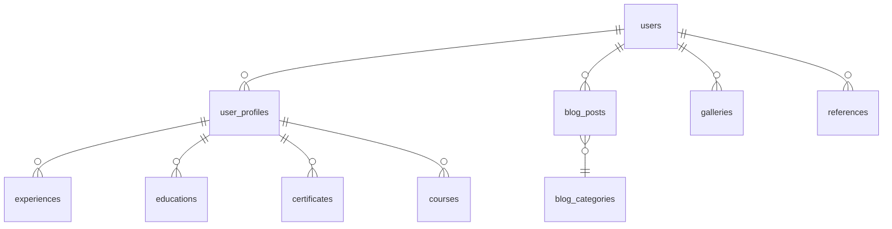

# Teknik Dokümantasyon

## 1. API Dokümantasyonu (OpenAPI/Swagger)

```yaml
openapi: 3.0.0
info:
  title: CVBlog API
  version: 1.0.0
  description: |
    Türkçe: CVBlog uygulamasının REST API uç noktaları. Tüm endpointler JWT/Sanctum ile korunur.
servers:
  - url: https://rifatrahvali.com.tr/api/v1
paths:
  /posts:
    get:
      summary: Blog yazılarını listele
      responses:
        '200':
          description: Başarılı
          content:
            application/json:
              schema:
                type: array
                items:
                  $ref: '#/components/schemas/BlogPost'
  /posts/{slug}:
    get:
      summary: Blog yazısı detayı
      parameters:
        - in: path
          name: slug
          required: true
          schema:
            type: string
      responses:
        '200':
          description: Başarılı
          content:
            application/json:
              schema:
                $ref: '#/components/schemas/BlogPost'
components:
  schemas:
    BlogPost:
      type: object
      properties:
        id:
          type: integer
        title:
          type: string
        content:
          type: string
        published_at:
          type: string
          format: date-time
```
// Türkçe: API endpointleri Swagger/OpenAPI formatında dokümante edilmiştir. Her endpointin amacı ve dönen veri şeması açıklanmıştır.

## 2. Veritabanı Şeması

### Temel Tablolar ve İlişkiler

| Tablo         | Açıklama                |
|---------------|------------------------|
| users         | Kullanıcılar           |
| user_profiles | Kullanıcı profilleri    |
| blog_posts    | Blog yazıları          |
| blog_categories | Blog kategorileri     |
| experiences   | İş deneyimleri         |
| educations    | Eğitimler              |
| certificates  | Sertifikalar           |
| courses       | Kurslar                |
| galleries     | Galeri görselleri      |
| references    | Referanslar            |

#### İlişki Diyagramı (Mermaid)

// Türkçe: Tablolar ve ilişkiler yukarıdaki gibi yapılandırılmıştır. Her tablo ve ilişki amacıyla birlikte gösterilmiştir.

## 3. Mimari Genel Bakış

- **Katmanlar:**
  - Controller (HTTP isteklerini karşılar)
  - Service (İş mantığı)
  - Model (Veritabanı işlemleri)
  - Request (Validasyon)
  - Resource (API veri dönüşümü)
  - Policy (Yetkilendirme)
- **Klasör Yapısı:**
  - `app/Http/Controllers/` : Tüm controller'lar
  - `app/Services/` : Servis sınıfları
  - `app/Models/` : Eloquent modelleri
  - `app/Http/Requests/` : FormRequest validasyonları
  - `app/Http/Resources/` : API resource'ları
  - `app/Policies/` : Policy sınıfları
// Türkçe: MVC ve servis tabanlı mimari kullanılmıştır. Her katmanın sorumluluğu ayrıdır.

## 4. Kod Stili Rehberi

- **PSR-12** kod standartları uygulanır.
- **Türkçe açıklama**: Her fonksiyon, sınıf ve önemli kod bloğu altında Türkçe açıklama bulunur.
- **Örnek:**
```php
/**
 * Kullanıcı profilini günceller
 * @param UpdateProfileRequest $request
 * @return \Illuminate\Http\RedirectResponse
 */
public function update(UpdateProfileRequest $request)
{
    // Türkçe: Validasyon sonrası profil güncellenir
    $request->user()->profile->update($request->validated());
    // Türkçe: Başarılı güncelleme sonrası yönlendirme yapılır
    return redirect()->route('profile.show');
}
```
- **Değişken ve fonksiyon isimleri** İngilizce ve anlamlı olmalı.
- **Her yeni kod** test ile birlikte yazılmalı.
- **UTF-8** encoding hatalarından kaçınılmalı.
// Türkçe: Kodun okunabilirliği, sürdürülebilirliği ve test edilebilirliği için bu standartlara uyulmalıdır.

---

> Türkçe: Bu dosya, projenin teknik dokümantasyonunu, API, veritabanı, mimari ve kod stili açısından örneklerle ve açıklamalarla sunar. 